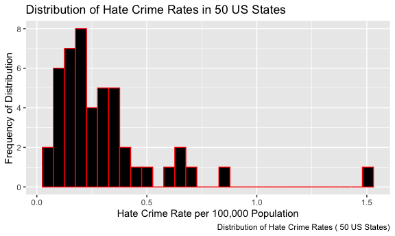
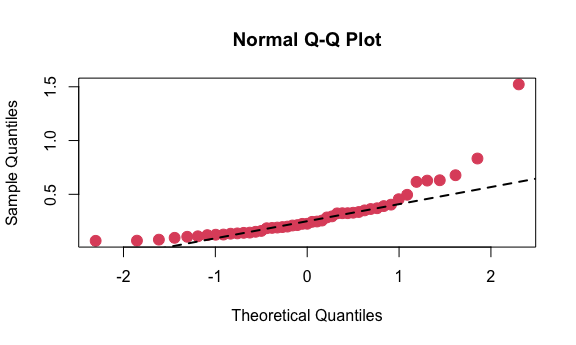

P8130 Final Project - Group 19
================

## Setup

##### General Setup

``` r
knitr::opts_chunk$set(
  echo = TRUE,
  include = TRUE,
  message = FALSE,
  warning = FALSE
)
```

##### Visualizations

``` r
knitr::opts_chunk$set(
  fig.width = 6,
  fig.asp = .6,
  fig.align="center",
  out.width = "90%"
)
```

##### Installations

``` r
library(tidyverse)
library(dplyr)
library(HH)
library(leaps)
library(corrplot) 
library(faraway)
library(broom)
```

##### Load Data Set

``` r
hate_crime = read_csv("data/HateCrimes.csv", col_types="fffdddddd") %>% 
  janitor::clean_names()
```

-----

# Data Exploration: Descriptive statistics and visualization

##### Histogram of Outcome Variable

From the histogram below, we observe our outcome distribution has right
skewness, suggesting that we may need to check our normality assumption.
Our QQ Plot also indicates severe departures from normality.

``` r
#Histogram of Outcome Distribution
hate_crime %>% 
  ggplot(aes(x = hate_crimes_per_100k_splc)) + 
  geom_histogram(color="red", fill="black") + 
  labs(
    title = "Distribution of Hate Crime Rates in 50 US States",
    x = "Hate Crime Rate per 100,000 Population",
    y = "Frequency of Distribution",
    caption = "Distribution of Hate Crime Rates ( 50 US States)")
```



##### QQ Plot of Outcome Variable

``` r
#QQplot of Outcome Distribution
hate_crimes_per_100k_splc = hate_crime$hate_crimes_per_100k_splc
qqnorm(hate_crimes_per_100k_splc, col=2, pch=19, cex=1.5)
qq_plot = qqline(hate_crimes_per_100k_splc, col = 1,lwd=2,lty=2)
```



##### Shapiro-Wilk Test of Outcome Variable

After performing a Shapiro-Wilk test to check the normality assumption
of our outcome distribution, we find evidence to suggest that our data
deviates from normality.

``` r
# Perform Shapiro-Wilk test
shapiro.test(hate_crimes_per_100k_splc) %>% 
  broom::tidy() %>% 
  knitr::kable("simple")
```

| statistic | p.value | method                      |
| --------: | ------: | :-------------------------- |
| 0.7331863 |   1e-07 | Shapiro-Wilk normality test |

##### Outcome Translation to fit Normality (Vihar)

Identify states with unusual rates and consider them as potential
outliers/influential points. (Jyoti)  

# Income inequality was the main predictor of hate crime rates

Verify if this association holds true, as well as explore associations
of all the other covariates mentioned above and draw your own
conclusions.(Linh)  

Multicollinearity (Nikhita)  

Interaction between variables (e.g., urbanization), fit stratified
models if the case. (Yanzhe Ma)  

# Model diagnostics

Check model assumptions and goodness of fit (Vihar Desu)
